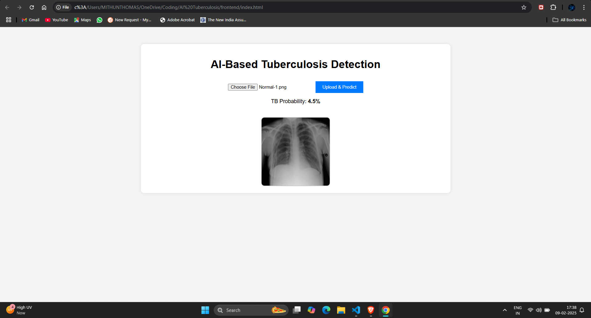

<h1 align="center">
AI Tuberculosis Detection
</h1>

AI-powered web application for detecting tuberculosis (TB) from chest X-ray images using a deep learning model. The backend is built with **FastAPI**, and the frontend is developed with **HTML, CSS, and JavaScript**.

---

## 🖼 **Project Overview**

AI Tuberculosis Detection uses machine learning to detect tuberculosis from chest X-ray images. The model is hosted via a FastAPI backend, and the frontend allows users to upload X-ray images and receive real-time predictions.

**Key Highlights:**
- FastAPI-powered backend for quick image processing.
- User-friendly frontend built with HTML, CSS, and JavaScript.
- Predicts the probability of tuberculosis based on uploaded chest X-rays.
- Real-time preview of the X-ray image before uploading.



## 🚀 Features

✅ Predicts tuberculosis probability from chest X-ray images.
✅ Provides a user-friendly web interface.
✅ Supports real-time image preview before uploading.
✅ FastAPI-based backend for quick API responses.
✅ Cross-Origin Resource Sharing (CORS) enabled for frontend-backend communication.

## 📂 Folder Structure

```
├── backend/                   # FastAPI backend
│   ├── main.py                # FastAPI app
│   ├── model/                 # Pretrained TB detection model
│   ├── requirements.txt       # Backend dependencies
├── frontend/                  # HTML, CSS, and JavaScript frontend
│   ├── index.html             # Frontend UI
│   ├── style.css              # Styling
│   ├── script.js              # JavaScript for frontend logic
├── assets/                    # Images and other assets
│   ├── demo-image.png         # Demo image for README
├── README.md                  # Project documentation
```

## 🛠 Installation & Setup

### 🔧 Prerequisites

- Python 3.10+
- Virtual Environment (venv)

### 📌 Backend Setup

```bash
# Clone the repository
git clone https://github.com/your-username/ai-tuberculosis-detection.git
cd ai-tuberculosis-detection/backend

# Create and activate virtual environment
python -m venv venv
source venv/bin/activate  # For Mac/Linux
venv\Scripts\activate     # For Windows

# Install dependencies
pip install -r requirements.txt

# Run the FastAPI server
uvicorn main:app --host 127.0.0.1 --port 8000 --reload
```

### 🎨 Frontend Setup

```bash
# Navigate to frontend folder
cd ../frontend

# Open index.html in a browser
```

## 🌐 Usage

1. Open `index.html` in a browser.
2. Upload a **chest X-ray image**.
3. The model predicts the probability of tuberculosis.

## 🚀 Deployment

### 📌 Free Hosting Options:

- **Frontend:** GitHub Pages, Netlify, Vercel
- **Backend:** Render, Railway, Hugging Face Spaces

## 🤝 Contributing

Pull requests are welcome! Feel free to improve the model, frontend, or backend.

## 📜 License

This project is licensed under the **MIT License**.

---

⭐ **Star this repository if you found it useful!**

